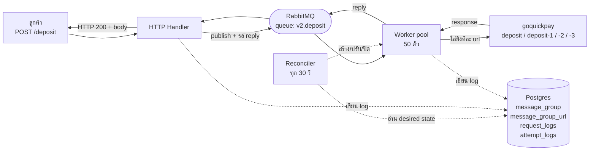
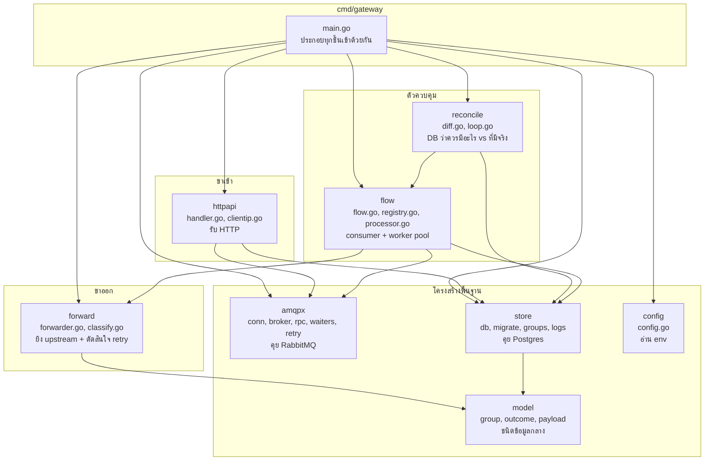
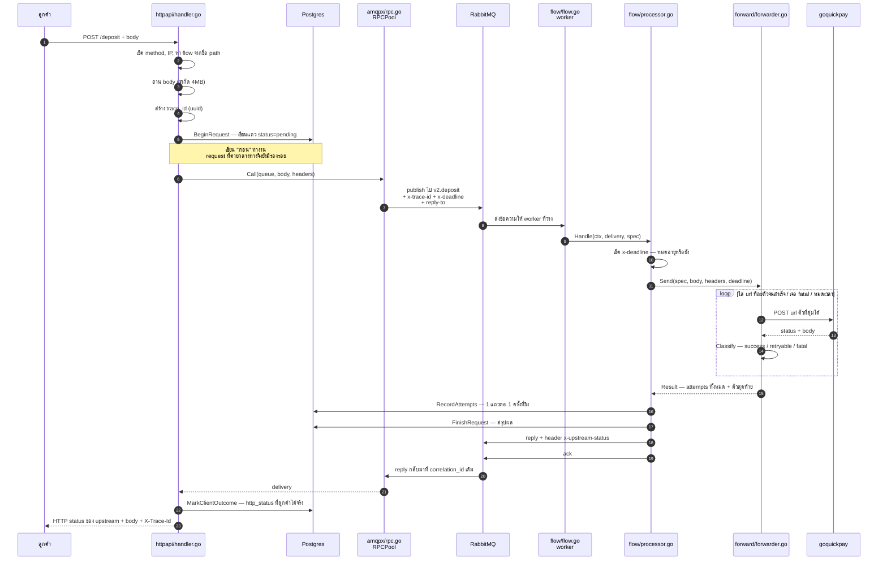
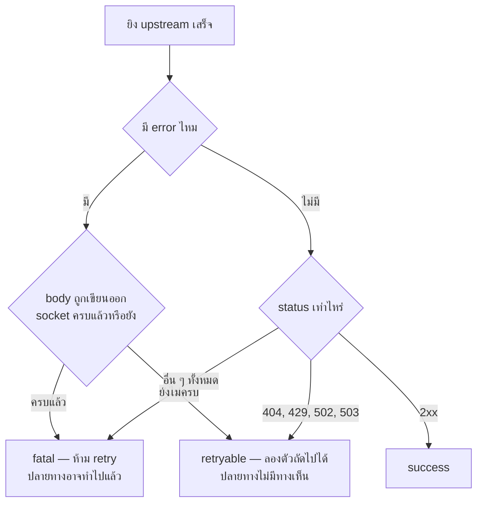
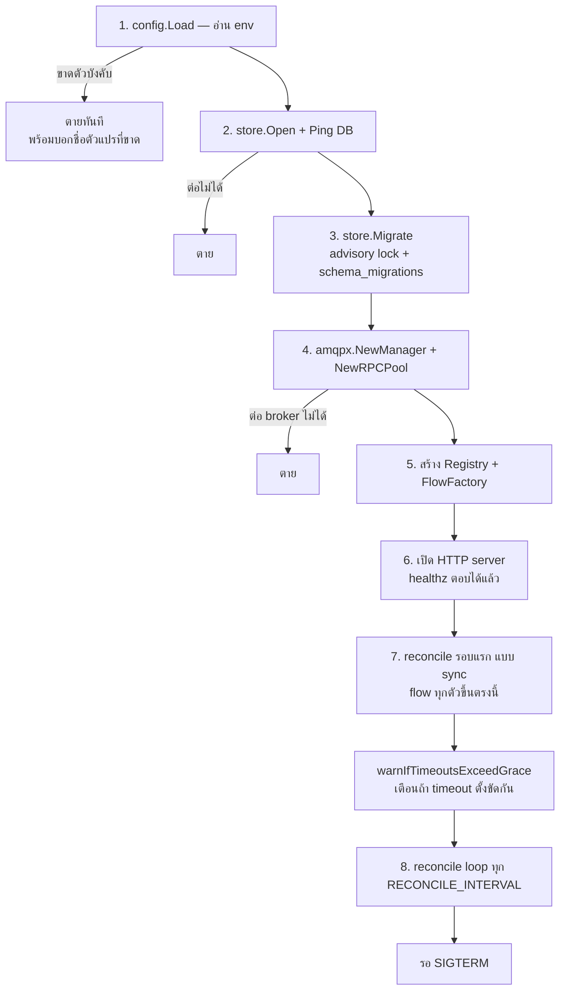
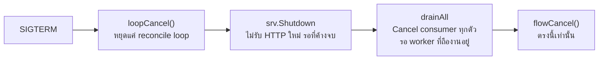
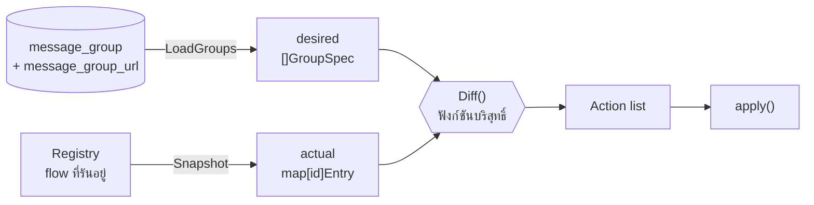
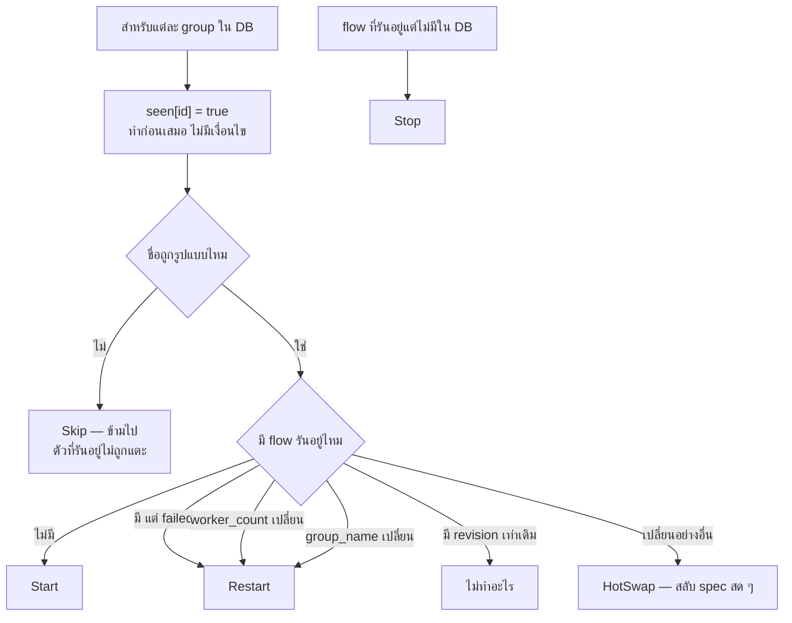
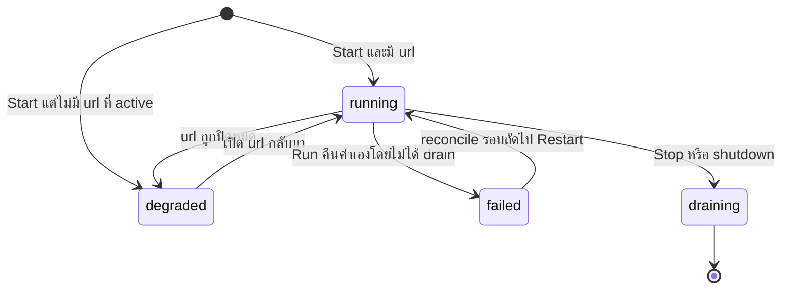

# MQ Gateway v2 — เดินดูโค้ดทั้งระบบ

เอกสารนี้เขียนให้คนที่**ไม่เคยเห็นระบบนี้มาก่อนเลย** อ่านจบแล้วต้องอธิบายให้คนอื่นฟังได้
และหาสาเหตุได้เมื่อมีอะไรผิดปกติ

อ่านตามลำดับ: ภาพรวม → เดินตาม request หนึ่งใบ → ตอน service สตาร์ท → reconciler
→ ลงลึกทีละไฟล์ → คู่มือหาปัญหา

ถ้าอยากรู้ว่าต่างจากระบบเก่ายังไง อ่าน `v1-vs-v2.md` คู่กัน

---

## 1. ระบบนี้คืออะไร ใน 60 วินาที

มันคือ **ตัวกลางที่รับ HTTP จากลูกค้า แล้วไปยิง API ปลายทางให้ โดยมี RabbitMQ คั่นตรงกลาง**

ทำไมต้องมี RabbitMQ คั่น? เพราะ API ปลายทาง (goquickpay) รับงานพร้อมกันได้จำกัด
คิวทำหน้าที่เป็นตัวกันไม่ให้ยิงทะลักเกินที่ปลายทางรับไหว และทำให้ปรับจำนวน worker ได้

สิ่งที่ต่างจาก gateway ทั่วไปคือ **ทุกอย่างมาจาก database ไม่ใช่ config ไฟล์**
เพิ่มแถวใน `message_group` = มี endpoint ใหม่ + queue ใหม่ + consumer ใหม่ ภายใน 30 วินาที
โดยไม่ต้อง deploy ไม่ต้อง restart ไม่ต้อง curl อะไรเลย



**คำศัพท์ที่ต้องรู้ 4 คำ** — ทั้งหมดหมายถึงของชิ้นเดียวกันคนละมุม

| คำ | คือ |
|---|---|
| **group** | 1 แถวใน `message_group` เช่น `deposit` |
| **flow** | object ในหน่วยความจำที่รันอยู่จริงของ group นั้น |
| **queue** | คิวบน RabbitMQ ชื่อ `<QUEUE_PREFIX><group_name>` เช่น `v2.deposit` |
| **endpoint** | path HTTP `POST /<group_name>` เช่น `POST /deposit` |

**1 group = 1 flow = 1 queue = 1 endpoint** จำประโยคนี้ประโยคเดียวพอ

---

## 2. แผนที่ไฟล์ — ใครทำอะไร

23 ไฟล์ 2,481 บรรทัด แบ่งเป็น 8 แพ็กเกจ แต่ละแพ็กเกจมีหน้าที่เดียว



หลักที่ใช้แบ่ง: **แพ็กเกจชั้นล่างไม่รู้จักชั้นบน** `model` ไม่ import ใครเลย
`forward` ไม่รู้ว่ามี RabbitMQ อยู่ในโลก `httpapi` ไม่รู้ว่า upstream คือใคร
ทำให้เทสต์แต่ละชิ้นแยกกันได้โดยไม่ต้องมี broker หรือ DB จริง

---

## 3. เดินตาม request หนึ่งใบ ตั้งแต่ต้นจนจบ

นี่คือหัวใจ ถ้าเข้าใจหัวข้อนี้หัวข้อเดียวก็อธิบายระบบได้ 80%



### จุดตัดสินใจสำคัญ 5 จุดบนเส้นทางนี้

**จุดที่ 1 — `x-deadline` (ตอน publish)**
`handler.go` คำนวณ `deadline = now + rpc_timeout` แล้วแนบไปกับข้อความ
worker ที่หยิบข้อความขึ้นมาหลังเวลานั้น **จะไม่ยิง upstream เลย** บันทึกเป็น `status='expired'`

ทำไมสำคัญ: ถ้าคิวยาวหรือ service เพิ่ง restart ข้อความเก่าจะถูกประมวลผลตอนที่ลูกค้าเลิกรอไปนานแล้ว
ระบบเก่าจะสร้างออเดอร์จริงให้คนที่ได้ 504 ไปแล้ว — เรียกว่า "ออเดอร์ผี"

**จุดที่ 2 — สับไพ่ url (`forwarder.go`)**
url ทั้งชุดถูกสับลำดับก่อนยิงเสมอ ไม่ได้ไล่จากตัวแรกลงมา
ทำให้โหลดกระจายและไม่มีตัวไหนเป็น "ตัวแรกที่โดนตลอด"

**จุดที่ 3 — `Classify` ตัดสินว่า retry ได้ไหม (`classify.go`)**
นี่คือโค้ด 20 บรรทัดที่สำคัญที่สุดในระบบ เพราะตัดสินใจผิด = ถอนเงินซ้ำ



ตัวชี้ขาดคือ `httptrace.WroteRequest` ซึ่งบอกว่า body ถูกเขียนออก socket ครบหรือยัง

- **ยังไม่ครบ** = DNS หาไม่เจอ, connection refused, TLS handshake fail → ปลายทางไม่มีทางเห็นคำขอ → ลองตัวถัดไปได้อย่างปลอดภัย
- **ครบแล้ว** = timeout ตอนรอ response, connection reset กลางคัน → **ปลายทางอาจสร้างออเดอร์ไปแล้ว** → ห้ามลองซ้ำเด็ดขาด

`500` ถูกจัดเป็น fatal ด้วยเหตุผลเดียวกัน — แอปปลายทางรับคำขอไปแล้ว อาจทำไปบางส่วน

> ห้ามทำให้ตารางนี้ config ได้ มันเป็นความถูกต้องทางธุรกิจ ไม่ใช่ตัวเลขไว้ปรับจูน

**จุดที่ 4 — งบเวลาต่อ attempt (`forwarder.go`)**
แต่ละครั้งที่ยิงได้เวลา `min(upstream_timeout, เวลาที่เหลือถึง deadline)`
และถ้าเหลือน้อยกว่า 1 วินาทีจะไม่เริ่มครั้งใหม่ เพราะเริ่มไปก็ไม่ทัน

นี่คือที่มาของกฎ **`upstream_timeout × จำนวน url ≤ rpc_timeout`** —
ถ้าละเมิด ลูกค้าจะได้ 504 ก่อนที่ระบบจะได้ลอง url ครบทุกตัว
`main.go` เตือนตั้งแต่ตอน start ถ้าตั้งขัดกัน

**จุดที่ 5 — ใครเป็นเจ้าของคอลัมน์ไหนใน log**

| คอลัมน์ | เจ้าของ | เขียนเมื่อ |
|---|---|---|
| `status` | **worker** | รู้ผลจริงของ upstream |
| `http_status` | **ฝั่ง HTTP** | รู้ว่าลูกค้าได้อะไรกลับไปจริง |

แยกกันเพราะสองอย่างนี้ไม่เท่ากันเสมอไป เช่น worker ยิงสำเร็จแล้ว (`status=success`)
แต่ reply กลับมาช้าจนลูกค้าได้ 504 ไปแล้ว (`http_status=504`)
`MarkClientOutcome` จึงตั้ง `status='timeout'` **เฉพาะตอนที่ worker ยังไม่ได้เขียนผลของตัวเองลงมา**

---

## 4. ตอน service สตาร์ท — เกิดอะไรขึ้นตามลำดับ

ทั้งหมดอยู่ใน `cmd/gateway/main.go` อ่านไล่จากบนลงล่างได้เลย



**จุดที่ต้องเข้าใจ: ข้อ 7 คือหัวใจของการแก้ pain point เดิม**
ระบบเก่ามี `main.go` 13 บรรทัดที่เปิด HTTP อย่างเดียว ไม่สตาร์ท consumer เลย
คนต้อง `curl` 4 endpoint ทุกครั้งหลัง deploy ลืมเมื่อไหร่ฝากถอนตายเงียบ ๆ
ขณะที่ health check ยังตอบ 200

### ตอนปิด (SIGTERM)



**สอง context ที่ห้ามรวมกันเด็ดขาด**

| | คุมอะไร | ยกเลิกเมื่อไหร่ |
|---|---|---|
| `loopCtx` | reconcile ticker, การอ่าน DB, การ dial | ทันทีที่ได้ SIGTERM |
| `flowCtx` | อายุของ flow และ **request ที่ worker ถืออยู่ในมือ** | หลัง drain จบแล้วเท่านั้น |

ถ้าเอามารวมเป็นตัวเดียว ตอน deploy ทุก worker ที่กำลังทำ payment จะถูกฆ่าพร้อมกัน:
`forward.attempt` ได้ `context.Canceled` **หลัง** `WroteRequest` ไปแล้ว → `Classify` คืน fatal
= เราผลิต "ออเดอร์สถานะไม่แน่นอน" ขึ้นมาเองทุก deploy

และ `GRACEFUL_TIMEOUT` เป็นงบ **ก้อนเดียว** ของทั้ง shutdown ไม่ใช่ก้อนละขั้น —
`drainAll` ได้เวลาเท่าที่ `srv.Shutdown` เหลือให้

---

## 5. Reconciler — ตัวที่ทำให้ระบบ "dynamic"

แนวคิดยืมมาจาก Kubernetes controller: **อ่านสิ่งที่ควรเป็นจาก DB เทียบกับสิ่งที่รันอยู่จริง
แล้วออกคำสั่งให้ต่างกันน้อยที่สุด** ทำซ้ำเรื่อย ๆ ไม่มีวันจบ



### Diff ตัดสินยังไง



**`Revision()`** คือ sha256 ของ spec ทั้งก้อน ใช้ตอบคำถาม "เปลี่ยนไหม" ในการเทียบครั้งเดียว
สำคัญตรงที่มัน **เรียง url ก่อน hash** ไม่งั้นลำดับที่ DB คืนมาต่างกันจะทำให้ restart เปล่า ๆ

**ทำไม `worker_count` ต้อง Restart แต่ url ไม่ต้อง**
`worker_count` ไปตั้ง `Qos(prefetch)` ซึ่งเป็นค่าระดับ AMQP channel เปลี่ยนสด ๆ ไม่ได้
ส่วน url อยู่ใน `spec` ที่ worker อ่านใหม่ทุกข้อความ จึงสลับได้ทันทีด้วย `UpdateSpec` (atomic pointer)

**บรรทัด `seen[want.ID] = true` ที่ต้องอยู่บนสุด**
ถ้าย้ายไปไว้หลัง `continue` ของ Skip: มีคนพิมพ์ชื่อ group ผิดใน DB → ลูปที่สองจะคิดว่า id นั้น
หายไปจาก desired → ออก **Stop** ตามมา → drain consumer ที่กำลังรับออเดอร์จริงทิ้ง
เพราะแค่มีคนพิมพ์ผิด

### สถานะของ flow



`degraded` ยังถือว่า **ready** ใน `/readyz` เพราะ process ทำงานถูกต้องแล้ว
แค่ไม่มีปลายทางให้ยิง ซึ่งเป็นเรื่องของ config ไม่ใช่ความพร้อมของตัว service

---

## 6. ลงลึกทีละไฟล์

### `cmd/gateway/main.go` — 222 บรรทัด

จุดเดียวที่รู้จักทุกแพ็กเกจ ทำหน้าที่ **ประกอบ** ล้วน ๆ ไม่มี business logic
ถ้าอยากรู้ว่าอะไรต่อกับอะไร อ่านไฟล์นี้ไฟล์เดียวจบ

สิ่งที่น่าสนใจคือ `factory` — ฟังก์ชันที่ reconciler เรียกทุกครั้งที่ต้องสร้าง flow ใหม่
มันเปิด AMQP channel ใหม่ ประกอบ `Processor` แล้วคืน `Flow` ที่พร้อมรัน
reconciler ไม่รู้จัก RabbitMQ เลย รู้จักแค่ `FlowFactory`

`warnIfTimeoutsExceedGrace` เตือนสองเรื่องตอน start: `rpc_timeout + 10s > GRACEFUL_TIMEOUT`
และ `upstream_timeout × url > rpc_timeout` — เตือนอย่างเดียวไม่ปฏิเสธ เพราะเป็นค่าใน DB ที่แก้ทีหลังได้

---

### `internal/config/config.go` — 130 บรรทัด

อ่าน env ทั้งหมดในที่เดียวแล้ว **ตายตั้งแต่ start ถ้าตั้งผิด**
ระบบเก่าเรียก `strconv.Atoi(os.Getenv(...))` กระจายอยู่ใน consumer แต่ละตัว
พอค่าว่างก็ `log.Fatalf` กลาง runtime ฆ่าทั้ง container ตอนที่กำลังรับงานอยู่

`Load` รับ `getenv func(string) string` ไม่ใช่เรียก `os.Getenv` ตรง ๆ — เพื่อให้เทสต์ส่ง map เข้ามาได้

จุดที่ต้องระวัง: `ALLOWED_IPS` ว่าง **ไม่ได้แปลว่าเปิดหมด** แต่แปลว่าปิดหมด
ตั้งใจให้ fail-closed — ลืมตั้งแล้วไม่มีใครเข้าได้ ดีกว่าลืมตั้งแล้วเปิดให้ทั้งโลก

---

### `internal/model/` — ชนิดข้อมูลกลาง ไม่ import ใครเลย

**`group.go`** — `GroupSpec` คือหน่วยที่ reconciler ใช้ตัดสินใจทั้งหมด

- `ValidateName()` — regex `^[a-z0-9][a-z0-9_-]{0,63}$` เพราะชื่อนี้ถูกใช้เป็นทั้งชื่อ queue และ URL path พร้อมกัน และกันคำสงวน `healthz` / `readyz` ไม่ให้ไปทับ endpoint ของระบบ
- `QueueName(prefix)` — `prefix + name` จุดเดียวที่ตัดสินชื่อ queue จริง
- `HasUpstream()` — มี url ที่ active อย่างน้อย 1 ตัวไหม
- `Revision()` — sha256 ของทั้ง spec **เรียง url ก่อน hash**

**`outcome.go`** — enum สองชุด `Outcome` (ผลของการยิง 1 ครั้ง) และ `RequestStatus`
(ค่าในคอลัมน์ `request_logs.status`: `pending` `success` `failed` `no_upstream` `timeout` `expired`)

**`payload.go`** — สองฟังก์ชันที่กัน request พังเพราะเรื่องไม่เป็นเรื่อง

- `JSONOrRaw` — body ที่ไม่ใช่ JSON ถูกห่อเป็น `{"raw":"..."}` ก่อนลงคอลัมน์ JSONB ถ้าไม่ทำ `INSERT` จะล้มและพา request ตายทั้งใบทั้งที่ payload แค่ผิดรูป
- `ExtractRef` — ดึง `customer_order_id` (หรือ field ที่ group กำหนด) ออกมาเก็บเป็น `business_ref` หาไม่เจอคืนค่าว่าง **ไม่ถือเป็น error**

---

### `internal/store/` — คุย Postgres

**`db.go`** — เปิด connection pool (max 25, idle 10, lifetime 10 นาที)

**`migrate.go`** — migration ฝังใน binary ด้วย `//go:embed`

ลำดับ: ขอ `pg_advisory_lock(8412739)` → สร้าง `schema_migrations` → พยายามสร้าง `pgcrypto`
(ล้มได้ ไม่เป็นไร) → ไล่ไฟล์ตามชื่อ ข้ามอันที่เคยรัน → รันในทรานแซกชันของตัวเอง

`pgcrypto` อยู่นอกไฟล์ migration โดยเจตนา: ถ้าอยู่ในไฟล์แล้ว DB user ไม่มีสิทธิ์สร้าง extension
migration จะล้มทั้งก้อน และ Postgres 13+ มี `gen_random_uuid()` ในตัวอยู่แล้ว

**`groups.go`** — `LoadGroups` อ่าน desired state ทั้งระบบด้วย query เดียว

`LEFT JOIN` สำคัญ: group ที่ไม่มี url ที่ active ต้องถูกคืนมาพร้อม `URLs` ว่าง
ไม่ใช่หายไปเฉย ๆ เพื่อให้ reconciler ตัดสินเองว่ามันควรเป็น `degraded`
ถ้าใช้ `INNER JOIN` group นั้นจะหายจาก desired แล้วโดน **Stop** แทน

**`logs.go`** — 4 เมธอด ตรงกับ 4 จังหวะของชีวิต request

| เมธอด | เรียกโดย | ทำอะไร |
|---|---|---|
| `BeginRequest` | httpapi | เขียนแถวตอนรับเข้ามา `status=pending` |
| `RecordAttempts` | processor | เขียนทุก attempt ใน `INSERT` คำสั่งเดียว |
| `FinishRequest` | processor | เขียนผลจริงจากฝั่ง worker |
| `MarkClientOutcome` | httpapi | เขียนสิ่งที่ลูกค้าได้รับจริง |

`RecordAttempts` เป็น multi-row INSERT 9 คอลัมน์คำสั่งเดียวโดยตั้งใจ ถ้าแยกเป็น
1 INSERT + N UPDATE แล้ว UPDATE ตัวท้าย ๆ ล้ม แถวก่อนหน้าจะถูก commit ไปแล้วโดยไม่มี
`response_body` แต่ทั้ง call คืน error — แยกไม่ออกว่าไม่ได้บันทึกเลยหรือบันทึกแล้วแต่ response หาย
คำสั่งเดียวทำให้ผลมีแค่สองแบบ: ครบทุกแถว หรือไม่มีเลย

**`migrations/0001_init.sql`** — 4 ตาราง

`attempt_logs.trace_id` เป็น FK ไป `request_logs` แบบ `ON DELETE CASCADE` และ
`UNIQUE (trace_id, seq)` กันเขียนซ้ำ ส่วน index `idx_request_logs_pending` เป็น partial index
บน `status='pending'` เพื่อให้หา request ที่ค้างได้เร็วโดยไม่กิน storage

---

### `internal/amqpx/` — คุย RabbitMQ

**`conn.go` — `Manager`** ถือ connection **เดียว** ของทั้ง process และต่อใหม่เองเมื่อหลุด
ระบบเก่าเปิด connection ใหม่ทุก HTTP request ซึ่งแพงมากและทำให้ broker มี connection เป็นพัน

`Healthy()` ใช้ `TryLock` ไม่ใช่ `Lock` — เพราะ `connection()` ถือ mutex ค้างตลอด retry loop
ตอน broker ล่ม ซึ่งเป็นช่วงที่ `/readyz` ต้องตอบให้ได้มากที่สุด ถ้าใช้ `Lock` readiness จะค้าง
แทนที่จะตอบ 503 และ goroutine ของ HTTP handler จะค้างสะสมทุก probe interval
"ล็อกไม่ได้" แปลว่ามี redial ค้างอยู่ ซึ่งตามนิยามคือยังไม่ healthy อยู่แล้ว

**`broker.go` — `Broker`** คือ channel หนึ่งช่องที่ flow หนึ่งตัวใช้
ต้องแยกช่องต่อ flow เพราะ `Qos(prefetch)` เป็นค่าระดับ channel ใช้ร่วมกันไม่ได้

queue ประกาศเป็น `durable=true` (ตัวนิยาม queue รอดข้าม broker restart)
แต่**ข้อความไม่ตั้ง persistent โดยตั้งใจ** — ถ้า broker restart ข้อความที่รอดมาก็เลย `x-deadline`
ไปหมดแล้ว เก็บไว้ก็ไม่มีประโยชน์

**`rpc.go` — `RPCPool`** ฝั่งที่ publish แล้วรอ reply

ใช้ `amq.rabbitmq.reply-to` (Direct Reply-To) ซึ่งเป็น pseudo-queue ของ RabbitMQ
ไม่ต้องประกาศ queue ชั่วคราวต่อ request ทำให้เร็วกว่ามาก

ที่ต้องเป็น **pool** หลายช่องเพราะ `amqp091-go` ล็อกภายในตอน publish
ช่องเดียวจะ serialize ทั้งระบบ — ทุก request ต่อคิวรอกันเอง

`Call` คืน `*amqp.Delivery` ทั้งก้อน ไม่ใช่แค่ body เพราะฝั่ง HTTP ต้องอ่าน
header `x-upstream-status` จากมันด้วย

**`waiters.go`** — map จาก `correlation_id` → channel ของ goroutine ที่รออยู่

สองจุดที่เป็นหัวใจ:
- channel มี **buffer 1** ทำให้ `deliver` ไม่ block แม้ caller เลิกรอไปแล้ว
- `Call` มี `defer remove` **เสมอ** ไม่ว่าจะออกทางไหน ถ้าลืม map จะโตขึ้นทุก request ที่ timeout จนหน่วยความจำหมด

`Pending()` มีไว้เฝ้า leak ตัวนี้โดยเฉพาะ

**`retry.go`** — exponential backoff ที่รับ `sleep` เป็นพารามิเตอร์
เพื่อให้เทสต์ผ่าน 20 รอบได้ในไมโครวินาทีโดยไม่ต้องรอเวลาจริง

---

### `internal/flow/` — consumer + worker pool

**`registry.go` — `Registry`** map ของ flow ที่รันอยู่ ป้องกันด้วย `RWMutex`

`SetStateIf(id, f, state)` เช็ค **identity** ไม่ใช่แค่ว่า id มีอยู่
ตอน Restart มี flow สองตัวใช้ id เดียวกันช่วงสั้น ๆ (stop ตัวเก่า → start ตัวใหม่)
goroutine ของตัวเก่าที่กำลังตายต้องไม่ไป mark ตัวใหม่เป็น `failed`
ถ้าไม่เช็ค จะเกิด **Restart ปลอมทุกรอบ** เวลา config เปลี่ยนบ่อย
ซึ่งแต่ละครั้งคือการ drain consumer ที่แข็งแรงดีทิ้ง

**`flow.go` — `Flow`** ตัว consumer จริง

`Run(ctx)` **บล็อกจนกว่า channel ของ broker จะปิด แล้ว return เสมอ**
ห้ามใส่ `select {}` หรือบล็อกถาวรเด็ดขาด — ระบบเก่าทำแบบนั้นที่ `conswithdraw.go:284`
ทำให้ตอน AMQP หลุด worker ออกหมดแต่ goroutine ค้างถาวร ไม่มีใครรู้ว่ามันตาย

`Run` ปิด `Broker` ของตัวเองใน `defer` เพราะเป็นจุดเดียวที่ครบสามเงื่อนไข:
ครอบทุกทางออก (รวมทาง `DeclareQueue` ล้ม), รับประกันว่า worker จบหมดแล้ว (อยู่หลัง `wg.Wait()`),
และปิดได้ครั้งเดียวแน่นอน (single-use guard) ถ้าไม่ปิด ทุก restart จะทิ้ง channel ค้าง
จนชน `channel_max` (default 2047) แล้วเปิด flow ใหม่ไม่ได้อีก

ธงสองตัว `started` / `cancelled` ใต้ mutex เดียวกัน แก้ race สามแบบที่เจอจริงตอนพัฒนา:
`Drain` มาก่อน `Run` ประกาศ consumer tag, `Cancel` ถูกเรียกสองครั้งพร้อมกัน,
และ flow ที่ล้มตั้งแต่ startup

`UpdateSpec` ใช้ `atomic.Pointer` — worker อ่าน spec ใหม่ในข้อความถัดไปโดยไม่ต้อง restart
นี่คือกลไกที่ทำให้แก้ url ใน DB แล้วมีผลทันที

**`processor.go` — `Processor.Handle`** ประมวลผลข้อความหนึ่งใบจนจบ

**ack เสมอ ไม่ requeue ในทุกกรณี** เพราะ caller รอแบบ synchronous
requeue = สร้างออเดอร์ซ้ำให้คนที่เดินจากไปแล้ว ความล้มเหลวถูกบันทึกใน log แทน

`defer` สองชั้นเรียงตามลำดับ LIFO:
```
defer ที่ 1 (ลงทะเบียนก่อน) → recover + ack     ← ทำงานทีหลัง
defer ที่ 2 (ลงทะเบียนหลัง) → recover + เขียน log + reply 500
```
แยกกันเพราะถ้ารวมไว้ defer เดียว แล้วเกิด panic ซ้อนระหว่างจัดการ panic แรก
มันจะหลุดออกก่อนถึงบรรทัด ack → ข้อความกลายเป็น poison message ที่ requeue วนไม่รู้จบ

`amqpHeadersToHTTP` แปลง header ของ caller กลับเป็น `http.Header`
โดยตัด `x-trace-id` / `x-deadline` ของเราออก ไม่ให้หลุดไป upstream

---

### `internal/forward/` — ยิง upstream

**`classify.go`** — 20 บรรทัดที่สำคัญที่สุดในระบบ (ดูแผนภาพในหัวข้อ 3)

**`forwarder.go` — `Send`** ลูปหลัก

```
สับไพ่ url
สำหรับแต่ละ url:
    เหลือเวลาเท่าไหร่ถึง deadline — หมดแล้วหยุด
    ถ้าไม่ใช่ตัวแรกและเหลือ < 1 วิ — หยุด (เริ่มไปก็ไม่ทัน)
    งบครั้งนี้ = min(upstream_timeout, เวลาที่เหลือ)
    ยิง
    ถ้าผลไม่ใช่ retryable — จบ
```

`attempt` มีรายละเอียดที่ต้องรู้:
- **hop-by-hop header ถูกตัดทิ้ง** รวม `Accept-Encoding` ซึ่งเป็นบั๊กจริงที่เจอตอน deploy — Traefik เติม `Accept-Encoding: gzip` ให้ทุก request พอเราส่งต่อ `net/http` ถือว่าเราจะแกะ gzip เองแล้วคืน byte ดิบมา ลูกค้าจึงได้ข้อมูลที่อ่านไม่ออกทั้งที่ประกาศว่าเป็น JSON **เทสต์ 138 ตัวจับไม่ได้** เพราะ httptest ไม่บีบอัดและไม่มี proxy คั่น
- **response เกิน 8MB ถูกปฏิเสธ ไม่ใช่ตัดทิ้ง** เพราะ JSON ที่ถูกตัดคือ JSON พังที่ลูกค้าแปลไม่ออก
- ไม่ตั้ง `Timeout` ที่ `http.Client` แต่คุมด้วย context ต่อ attempt แทน เพราะงบแต่ละครั้งไม่เท่ากัน

---

### `internal/reconcile/` — ตัวควบคุม

**`diff.go` — `Diff`** ฟังก์ชันบริสุทธิ์ล้วน ไม่แตะ DB ไม่แตะ broker
รับ desired + actual คืน list ของ action ทำให้ทดสอบทุกเคสได้โดยไม่ต้องมีอะไรจริงเลย

**`loop.go` — `Loop`**

- `Once(ctx, flowCtx)` — reconcile หนึ่งรอบ
- `Run(ctx, flowCtx)` — วนจนกว่า ctx จะถูกยกเลิก
- `apply` — แปลง action เป็นการกระทำจริง

`start()` ต้อง `Put` ด้วยสถานะสุดท้าย **ก่อน** สตาร์ท goroutine ถ้า `Put` เป็น `starting`
แล้วค่อย `SetState` ทีหลัง goroutine ที่ `Run` ล้มทันที (เช่น declare queue เจอ 406)
จะ set `failed` ก่อน แล้วโดนเขียนทับเป็น `running` — reconciler จะไม่มีวันรู้ว่า flow ตาย

`logf` เช็ค nil ก่อนเรียกทุกครั้ง เพราะ **ถ้า reconcile loop panic ระบบ dynamic ตายยกชุด**:
ไม่มีใครกู้ flow ที่ตาย ไม่มีใครรับ group ใหม่ การเงียบไปหนึ่งบรรทัด log
แลกกับการที่ loop ยังเดินต่อได้ เป็นการแลกที่คุ้มกว่ามาก

---

### `internal/httpapi/` — ขาเข้า

**`clientip.go` — `ClientIP`** หา IP จริงโดย **นับจากขวา** ของ chain

```
chain = X-Forwarded-For + RemoteAddr
        └─ caller ใส่เองได้ ─┘  └─ peer จริง ─┘

caller จริงอยู่ที่ตำแหน่ง (TRUSTED_PROXY_COUNT + 1) นับจากขวา
```

ระบบเก่าใช้ตัวซ้ายสุด (`homeController.go:75`) ซึ่งคือค่าที่ caller ใส่อะไรก็ได้ —
whitelist จึงหลอกได้ด้วย header เดียว

นี่คือเหตุผลที่ `TRUSTED_PROXY_COUNT` ต้องตั้งให้ตรงกับจำนวน proxy จริง
ตั้งมากไป = อ่านเลยไปเอาค่าที่ caller ควบคุมได้ ตั้งน้อยไป = เห็นแต่ IP ของ proxy

**`handler.go`** — ลำดับการตรวจ (แต่ละขั้นตอบกลับทันทีถ้าไม่ผ่าน)

| ลำดับ | ตรวจอะไร | ไม่ผ่านได้ |
|---|---|---|
| 1 | `/healthz` `/readyz` | — ตอบเลย |
| 2 | method เป็น POST | `405` |
| 3 | IP อยู่ใน allowlist | `403` |
| 4 | path เป็นชื่อเดียว ไม่มี `/` ซ้อน | `404` |
| 5 | มี flow ชื่อนี้ใน registry | `404` |
| 6 | flow อยู่ในสถานะ running และมี url | `503` + `Retry-After: 5` |
| 7 | body ไม่เกิน 4MB | `413` |
| 8 | `BeginRequest` เขียน DB ได้ | `503` |
| 9 | ได้ reply ภายใน `rpc_timeout` | `504` |

ข้อ 7 อ่านเกินลิมิตไป 1 ไบต์เพื่อ **ตรวจจับ** ว่าเกิน แล้วปฏิเสธ ไม่ใช่ตัดแล้วใช้ต่อ —
payload ที่ถูกตัดคือ JSON พังที่จะถูกเขียนลง log, ถูก `ExtractRef` ดึง ref ผิด
และถูกยิง upstream ราวกับเป็นของสมบูรณ์

ข้อ 8 สำคัญเชิงหลักการ: **เขียน log ไม่ได้ = ไม่ทำงานต่อ** เพราะออเดอร์ที่ไม่มีร่องรอย
แย่กว่าออเดอร์ที่ไม่ได้สร้าง

`upstreamStatus` clamp ค่านอกช่วง 100–999 เป็น `502` เพราะ `WriteHeader` จะ panic ทันที
ถ้าได้ค่านอกช่วง — ไม่พึ่งสมมติฐานว่าฝั่งที่ publish reply ส่งค่าถูกเสมอ

---

## 7. คู่มือหาปัญหา

### เริ่มจากสามคำสั่งนี้เสมอ

```bash
# 1. service พร้อมไหม flow ขึ้นครบไหม
curl -s https://<host>/readyz

# 2. request ล่าสุดเป็นยังไง
./scripts/live-test.sh recent 20

# 3. เจาะ request ที่มีปัญหา
./scripts/live-test.sh trace <trace_id>
```

### อาการ → ดูที่ไหน

| อาการ | น่าจะเพราะ | ตรวจยังไง |
|---|---|---|
| `404` ทุก request | ไม่มี group ใน DB หรือชื่อไม่ตรง path | `SELECT group_name FROM message_group;` และดู log หา `⏭ ข้าม group` |
| `403` ทุก request | `ALLOWED_IPS` ไม่มี IP นั้น หรือ `TRUSTED_PROXY_COUNT` ผิด | log มี `🚫 ปฏิเสธ IP <ip>` — เอา ip ตัวนั้นไปเทียบกับ env |
| `503` + `Retry-After` | flow ยังไม่ `running` หรือไม่มี url ที่ active | `/readyz` ดู state และ `SELECT * FROM message_group_url WHERE is_active;` |
| `504` เป็นระยะ | upstream ช้ากว่า `rpc_timeout` หรือ worker ไม่พอ | ดู `total_ms` ใน `request_logs` และนับ `status='pending'` ที่ค้าง |
| `502` | ยิงไม่ถึงปลายทางเลยสักตัว | `attempt_logs.error_message` จะบอกว่าติดตรงไหน |
| ตอบช้าผิดปกติ | ยิง url แรกไม่ติดแล้วไป fallback | `SELECT count(*) FROM attempt_logs WHERE seq > 1` |
| `/readyz` ตอบ `"amqp":"down"` | connection หลุดและกู้ไม่ได้ | ดู log หา `⏳ ต่อ RabbitMQ ไม่ได้` |
| `flows` ว่างทั้งที่มี group ใน DB | อ่าน DB ไม่ได้ | log `⚠️ reconcile ล้มเหลว` |
| แถวค้าง `pending` เยอะ | worker ตายหรือ reply ส่งกลับไม่ได้ | `/readyz` + log `⚠️ ส่ง reply ไม่สำเร็จ` |

### SQL ที่ใช้บ่อย

```sql
-- request ที่ค้าง pending เกิน 1 นาที = มีอะไรผิดปกติแน่นอน
SELECT trace_id, group_name, business_ref, created_at
FROM request_logs WHERE status='pending' AND created_at < now() - interval '1 min'
ORDER BY created_at;

-- url ไหนพังบ่อย ใน 1 ชั่วโมงที่ผ่านมา
SELECT url, outcome, count(*), round(avg(duration_ms)) AS avg_ms
FROM attempt_logs WHERE created_at > now() - interval '1 hour'
GROUP BY url, outcome ORDER BY url, count DESC;

-- มี request ไหนต้อง fallback บ้าง (ยิงเกิน 1 ครั้ง)
SELECT r.trace_id, r.business_ref, r.status, count(a.*) AS attempts
FROM request_logs r JOIN attempt_logs a USING (trace_id)
WHERE r.created_at > now() - interval '1 day'
GROUP BY r.trace_id, r.business_ref, r.status HAVING count(a.*) > 1;

-- ตามหาออเดอร์จากเลขที่ลูกค้าแจ้งมา
SELECT * FROM request_logs WHERE business_ref = 'ORD-12345';

-- เคสที่ต้องกระทบยอดด้วยมือ: ยิงไปแล้วแต่ไม่รู้ผล
SELECT r.trace_id, r.business_ref, a.url, a.error_message
FROM request_logs r JOIN attempt_logs a USING (trace_id)
WHERE a.outcome='fatal' AND a.http_status IS NULL;
```

แถวสุดท้ายคือชุดที่ต้องดูที่สุด — `outcome='fatal'` แต่ไม่มี `http_status`
แปลว่าส่งคำขอออกไปแล้วแต่ไม่ได้คำตอบกลับมา **ปลายทางอาจสร้างออเดอร์ไปแล้ว**
ระบบตั้งใจไม่ retry เคสนี้ ต้องเช็คกับ goquickpay ด้วยมือ

### ใครถูกบล็อกที่ชั้น allowlist บ้าง

**request ที่ถูกปฏิเสธไม่เคยถึง `request_logs`** เพราะเช็ค IP เป็นขั้นที่ 3 ส่วน `BeginRequest`
เป็นขั้นที่ 8 — `request_logs` ที่ว่างจึงแยกไม่ออกระหว่าง "ทุกคนถูกบล็อก" กับ "ไม่มีใครยิงเข้ามา"

ตาราง `blocked_ip` เก็บเป็นตัวนับไว้ตอบคำถามนี้ (1 แถวต่อ ip+path+เหตุผล ไม่ใช่ 1 แถวต่อ request)

```sql
-- ใครถูกบล็อก เสียไปกี่รายการ เริ่มเมื่อไหร่
SELECT client_ip, path, reason, count, first_seen, last_seen
FROM blocked_ip ORDER BY count DESC;

-- เฉพาะ IPv6 — ลูกค้า dual-stack ที่ ALLOWED_IPS (ซึ่งเป็น IPv4 ล้วน) ไม่ครอบคลุม
SELECT * FROM blocked_ip WHERE client_ip LIKE '%:%';

-- เพิ่งเริ่มโดนใน 1 ชั่วโมงล่าสุด = มีอะไรเปลี่ยน
SELECT * FROM blocked_ip WHERE first_seen > now() - interval '1 hour';
```

| `reason` | แปลว่า | แก้ที่ไหน |
|---|---|---|
| `not_in_allowlist` | IP ไม่อยู่ใน `ALLOWED_IPS` | เพิ่ม IP หรือดูว่า `TRUSTED_PROXY_COUNT` ถูกไหม |
| `missing_trusted_header` | ตั้ง `CLIENT_IP_HEADER` ไว้แต่คำขอไม่มี header นั้น | คำขอไม่ได้ผ่าน proxy ที่ประกาศว่าเชื่อถือ |

ถ้า `count` ในตารางน้อยกว่าที่เห็นใน log ให้ดูบรรทัด `⚠️ blocked_ip: ทิ้งไป N ครั้งเพราะคิวเต็ม`
— ตัวนับนี้ยอมทิ้งเมื่อล้นโดยตั้งใจ เพื่อไม่ให้การถูกปฏิเสธไปถ่วงความเร็วหรือกลายเป็นคันโยกให้ยิงถล่ม

### แก้ปัญหาโดยไม่ต้อง deploy

```sql
-- ปิด url ที่ล่ม (มีผลภายใน 30 วิ ไม่ restart)
UPDATE message_group_url SET is_active=false WHERE url LIKE '%deposit-2%';

-- เพิ่ม worker (ตัวนี้ทำให้ flow restart เพราะต้องตั้ง prefetch ใหม่)
UPDATE message_group SET worker_count=100 WHERE group_name='deposit';

-- ปิดทั้ง flow ชั่วคราว — endpoint จะหายไปเลย ตอบ 404
DELETE FROM message_group WHERE group_name='deposit';
```

### อ่าน log ให้เป็น

| สัญลักษณ์ | ความหมาย |
|---|---|
| `▶️ <ชื่อ>: ทำงานแล้ว` | flow ขึ้นเรียบร้อย |
| `🔄 <ชื่อ>: อัปเดต url/config` | HotSwap สำเร็จ ไม่มีการ restart |
| `♻️ <ชื่อ>: restart (เหตุผล)` | ต้อง restart จริง ดูเหตุผลที่ต่อท้าย |
| `⏭ ข้าม group <ชื่อ>` | ชื่อไม่ผ่าน validation — แก้ชื่อใน DB |
| `🛑 <ชื่อ>: ปิด` | ถูกลบออกจาก DB แล้ว |
| `⏹ <ชื่อ>: flow หยุดเอง` | consumer ตายเอง จะกู้รอบถัดไป |
| `⏳ ต่อ RabbitMQ ไม่ได้` | กำลัง retry — ถ้าขึ้นรัว ๆ แปลว่า broker มีปัญหาจริง |
| `💥 panic` | บั๊กในโค้ด เก็บ log ไปเปิด issue |
| `⚠️ group X: ... เกิน ...` | config ใน DB ตั้งขัดกัน แก้ที่ DB |

---

## 8. สรุปสิ่งที่ต้องจำ

1. **1 group = 1 flow = 1 queue = 1 endpoint** ทุกอย่างมาจาก DB
2. **`Classify` ตัดสินว่า retry ได้ไหม** และ retry ได้เฉพาะเมื่อมั่นใจว่าคำขอไปไม่ถึงปลายทาง
3. **`x-deadline` กันออเดอร์ผี** worker ไม่ยิง upstream หลังลูกค้าเลิกรอแล้ว
4. **reconciler ทำให้ทุกอย่าง dynamic** แก้ DB มีผลใน 30 วิ ไม่ต้อง deploy
5. **`trace_id` ตามได้ทุก request** ตั้งแต่รับเข้ามาจนถึง url ที่ยิงไปทีละตัว
6. **`QUEUE_PREFIX` คือตัวกันชนกับระบบเก่า** ห้ามปล่อยว่างเด็ดขาด

เอกสารที่เกี่ยวข้อง: `v1-vs-v2.md` (เทียบระบบเก่า) · `smoke-test-gateway.md` (ทดสอบ + rollback)
· `traffic-analysis.md` (ปริมาณจริง) · `mq-gateway-v2-followups.md` (งานค้าง)
· `superpowers/specs/2026-09-25-mq-gateway-refactor-design.md` (spec ต้นทาง)
